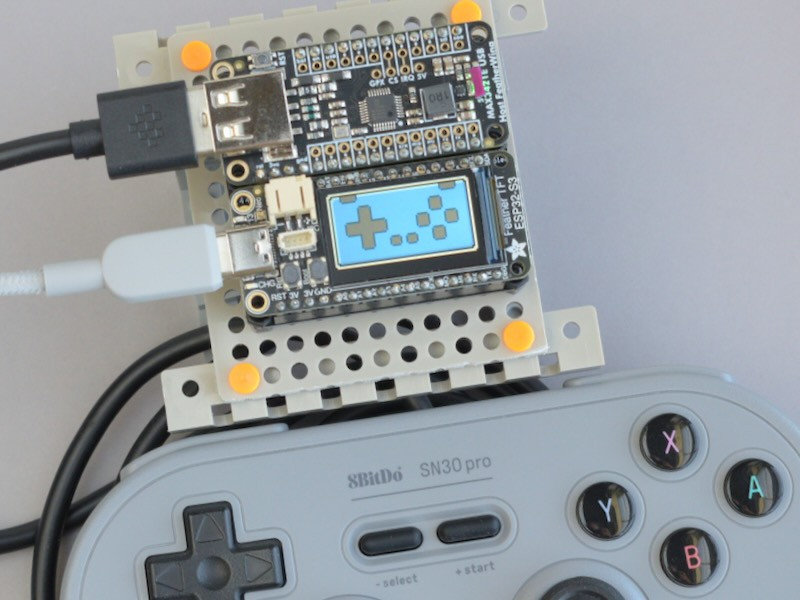
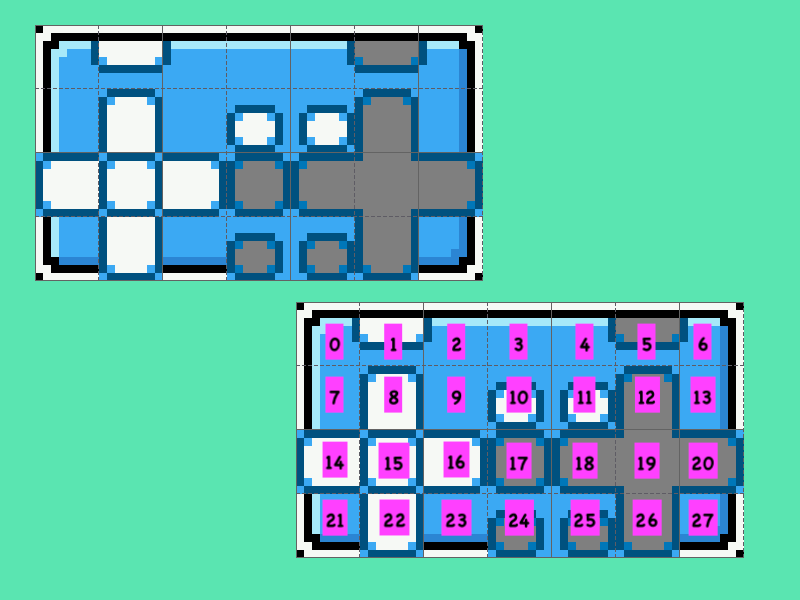

<!-- SPDX-License-Identifier: MIT -->
<!-- SPDX-FileCopyrightText: Copyright 2024 Sam Blenny -->
# Feather TFT Gamepad

This demonstrates a visual USB gamepad tester using using an Adafruit
USB Host FeatherWing, an ESP32-S3 TFT Feather, and sprites created
in Krita.


<br>*Feather TFT dev board with USB gamepad and a sprite-based gamepad tester
display*


<br>*8x zoomed view of gamepad tester spritesheet with and without sprite
numbers*


## Hardware


### Parts

- Adafruit ESP32-S3 TFT Feather - 4MB Flash, 2MB PSRAM
  ([product page](https://www.adafruit.com/product/5483),
  [learn guide](https://learn.adafruit.com/adafruit-esp32-s3-tft-feather))

- Adafruit USB Host FeatherWing with MAX3421E
  ([product page](https://www.adafruit.com/product/5858),
  [learn guide](https://learn.adafruit.com/adafruit-usb-host-featherwing-with-max3421e))

- Adafruit FeatherWing Doubler
  ([product page](https://www.adafruit.com/product/2890))

- Tamiya Universal Plate Set #70157
  (3mm thick, 160x60mm ABS plates with 3mm holes on 5mm grid)

- M2.5 Nylon Standoff Set
  (misc. M2.5 machine screws, standoffs, and nuts)


### Tools and Consumables

- Soldering iron

- Solder

- Breadboard (Adafruit [#65](https://www.adafruit.com/product/65),
  [#239](https://www.adafruit.com/product/239),
  or similar)

- Soldering Vise (Adafruit [#3197](https://www.adafruit.com/product/3197) or
  similar)

- Flush diagonal cutters
  (Adafruit [#152](https://www.adafruit.com/product/152) or similar)

- Adhesive tape with clean-removable adhesive (Kapton tape, 3M Scotch 35
  electrical tape, blue painter's tape, or whatever)


### Pinouts

| TFT feather | USB Host | ST7789 TFT |
| ----------- | -------- | ---------- |
|  SCK        |  SCK     |            |
|  MOSI       |  MOSI    |            |
|  MISO       |  MISO    |            |
|  D9         |  IRQ     |            |
|  D10        |  CS      |            |
|  TFT_CS     |          |  CS        |
|  TFT_DC     |          |  DC        |


## Assemble the Hardware

If you are unfamiliar with soldering headers, you might want to read:

- [Adafruit Guide To Excellent Soldering](https://learn.adafruit.com/adafruit-guide-excellent-soldering/tools)

- [How To Solder Headers](https://learn.adafruit.com/how-to-solder-headers)


### Order of Soldering

1. The TFT Feather and USB Host Featherwing each come with two strips of
   16-position male header. Since feather boards have 16 holes on one side and
   12 holes on the other, use your flush cutters to trim 4 pins off the header
   strips for the 12-hole sides.

2. Assemble the USB Host Featherwing with pin headers on a breadboard, then
   solder the headers in place.

3. Locate the set of regular (non-stacking) female headers from your
   Featherwing Doubler kit. Remove the USB host featherwing from
   the breadboard, then put female headers onto the pins of the USB
   host featherwing.

4. Using the USB host featherwing to hold the female headers in place, put the
   female header pins into one of the silkscreened Feather footprints of the
   Doubler. Tape the ends of the USB host featherwing to the Doubler, being
   careful not to cover any of the pins.

5. Clamp the Doubler in a vise and solder the female headers in place.

6. Locate the set of female stacking headers from your Doubler kit. Remove the
   USB host featherwing from the Doubler, then put the stacking headers onto
   the pins of the USB host board.

7. Put the stacking header pins into the other silkscreen footprint of your
   Doubler board, then prepare the assembly as before with tape and a vise.

8. Solder the stacking header pins in place, then trim the excess length off
   the pins with your flush cutters.

9. Carefully assemble your ESP32-S3 TFT Feather with header pins on a
   breadboard. Leave the protective film in place to protect the display from
   flux splatter. Solder the header pins in place. You can use the solder wire
   to bend the pull tab of the protective film out of the way so it does not
   touch your soldering iron.


### Smoke Test and Final Assembly

1. (optional) Mount your Doubler board on a backplate (such as a Tamiya
   Universal Plate) so the board is easier to handle without shorts or static
   discharges.

2. Assemble the TFT feather and USB host featherwing onto the Doubler.

3. Try plugging your board into a USB charger to make sure the LEDs light up.

4. If the LEDs light up, unplug the USB power cable, then plug the USB gamepad
   into the Host featherwing's USB A port.


## Updating CircuitPython

**NOTE: To update CircuitPython on the ESP32-S3 TFT Feather with 2MB PSRAM and
4MB Flash, you need to use the .BIN file (combination bootloader and
CircuitPython core)**

1. Download the CircuitPython 9.1.1 **.BIN** file from the
   [Feather ESP32-S3 TFT PSRAM](https://circuitpython.org/board/adafruit_feather_esp32s3_tft/)
   page on circuitpython.org

2. Follow the instructions in the
   [Web Serial ESPTool](https://learn.adafruit.com/circuitpython-with-esp32-quick-start/web-serial-esptool)
   section of the "CircuitPython on ESP32 Quick Start" learn guide to update
   your board with CircuitPython 9.1.1. First erasing the board's contents,
   then programming it with the .BIN file. **(CAUTION: the normal UF2 file
   method does not work on this board because it does not have a large enough
   flash drive to hold the CircuitPython UF2 file)**


## Installing CircuitPython Code

To copy the project bundle files to your CIRCUITPY drive:

1. Download the project bundle .zip file using the button on the Playground
   guide or the attachment download link on the GitHub repo Releases page.

2. Expand the zip file by opening it, or use `unzip` in a Terminal. You should
   end up with a folder named prox-sensor-encoder-menu, which should contain a
   `README.txt` file and a `CircuitPython 9.x` folder.

3. Open the CircuitPython 9.x folder and copy all of its contents to your
   CIRCUITPY drive.

To learn more about copying libraries to your CIRCUITPY drive, check out the
[CircuitPython Libraries](https://learn.adafruit.com/welcome-to-circuitpython/circuitpython-libraries)
section of the
[Welcome to CircuitPython!](https://learn.adafruit.com/welcome-to-circuitpython)
learn guide.


## Running the Gamepad Demo Code

1. Connect the USB gamepad to the MAX3421E USB Host Featherwing before applying
   power to the Feather TFT. (USB hot plugging may be unreliable)

2. Plug a computer or charger into the Feather TFT ESP32-S3 USB C port. You
   should see some boot messages followed by a pixel art gamepad with gray
   buttons.

3. When you press buttons on the USB gamepad, you should see the corresponding
   button sprites on the Feather TFT change from gray to white.

*CAUTION: This code was tested with an 8BitDo SN30 Pro USB wired gamepad, which
uses the XInput protocol and identifies itself with the vendor and product IDs
of an Xbox 360 gamepad (045e:028e). This code may not work properly with other
gamepads.*

If you want to see debug messages about gamepad connection status, you can
[connect to the serial console](https://learn.adafruit.com/welcome-to-circuitpython/kattni-connecting-to-the-serial-console)
the Feather TFT's serial port.


## Understanding How the Code Works

The `main()` function of `code.py` is divided into three sections:

1. Initialize the TFT display's ST7789 controller and set up a
   `displayio.TileGrid` object to draw the gamepad image using sprites.

2. Initialize the MAX3421E USB host controller.

3. Start the `while True: ...` event loop that connects to a USB gamepad,
   reads input events from the gamepad, and updates the display as needed.

For details on how the gamepad driver works, take a look at `gamepad.py`.


### Important Concept #1: Bitfields and Digital Logic

The method used by the `update_GUI(scene, prev, buttons)` function of `code.py`
to decode button presses might be a bit mysterious if you are unfamiliar with
the concepts of [bitfields](https://en.wikipedia.org/wiki/Bit_field) and
[digital logic](https://learn.adafruit.com/binary-boolean-and-logic?view=all)

There's a whole lot of background material you could read about if you
wanted to. But, short version, understanding a few simple techniques makes it
possible to work with bitfields efficiently:

1. What is a bitfield? Suppose you have 8 buttons that can each have a value
   of pressed (1) or not pressed (0). You could store each value as its own
   integer, but that would use many more bytes than necessary. To save
   space, you could instead treat one 8-bit integer as a bitfield, assigning
   each of its eight bits to represent a different button.

   For example, maybe button A is the least significant bit. When only
   button A is pressed, the integer's value would be 1 (decimal), 0x01
   (hex), or 0b00000001 (binary). Maybe you assign button B to the second
   least significant bit. In that case, if only button B is pressed, the
   integer's value would be 2 (decimal), 0x02 (hex), or 0b00000010 (binary).
   If you pressed buttons A and B at the same time, the value would be 3,
   0x03, or 0b00000011.

2. To detect when one or more of the bits in a bitfield have changed, you can
   write a loop to track the previous and current values of a bitfield, then
   compare the previous and current values in an if statement, like this:

   ```
   prev = thing.get_bitfield()
   while True:
       bits = thing.get_bitfield()
       if prev != bits:    # check if any bits changed
           do_stuff(bits)  #   do what needs doing when a bit has changed
           prev = bits     #   update the previous value
   ```

   A variation on this technique is used by `gamepad.XInputGamepad.poll()` to
   calculate the value that it returns for `changed`.

3. Once you know that one or more bits have changed, you can efficiently
   decode the bitfield using the XOR (`^` in python) and AND (`&` in Python)
   bitwise digital logic operators.

   If you want to understand why this works, you could try reading about
   digital logic and experimenting in a Python REPL. For the how part,
   you can use code like this to identify which bits changed and then do
   some appropriate action based on the current value:

    ```
    def update_GUI(scene, prev, buttons):
        # These are bitmask constants mapping buttons to their
        # corresponding bit (each of these is a 16-bit integer where
        # only 1 bit is set)
        B = 0x1000
        A = 0x2000
        Y = 0x4000
        X = 0x8000

        # Use XOR (^) to identify the specific bits that changed
        #   (try `"0b{:03b}".format(0b111 ^ 0b101)` in a Python REPL)
        diff = prev ^ buttons

        # Use AND (&) to calculate a boolean value that is True when a
        # specific button has changed (`diff & A`, `diff & B`, etc), or
        # when a button is currently pressed (`buttons & A`, `buttons &
        # B`, etc)
        if diff & A:
            scene[8, 2] = 15 if (buttons & A) else 17
        if diff & B:
            scene[7, 3] = 15 if (buttons & B) else 17
        if diff & X:
            scene[7, 1] = 15 if (buttons & X) else 17
        if diff & Y:
            scene[6, 2] = 15 if (buttons & Y) else 17
    ```


### Important Concept #2: Sprite Sheets and TileGrid

Many people have written a whole lot of stuff about using sprites to make
graphics for old video game consoles, emulators, fantasy consoles, and so
on. That stuff is
[interesting](https://en.wikipedia.org/wiki/Sprite_(computer_graphics)) and
[worth](https://learn.adafruit.com/circuitpython-display-support-using-displayio/sprite-sheet)
[reading](https://learn.adafruit.com/iot-twitter-listener-party-parrot/animating-sprites-with-circuitpython)
if you have the time. The short, drastically simplified version is there are
two main approaches to drawing computer graphics:

1. Make images where you set colors for each display pixel individually
   (good for realistic looking images, but uses lots of RAM and clock cycles)

2. Make images in the style of a mosaic, where you set groups of pixels at the
   same time using patterns (sprites or tiles) from a spritesheet (works on
   hardware with limited RAM and clock speed)

This image shows two different magnified views of the spritesheet I made in
[Krita](https://krita.org/en/) for my gamepad tester:


The top left portion came from a Krita screenshot with 800% zoom and 8px grid
divisions. The spritesheet has 28 sprites arranged into 4 rows of 7 columns
each. The sprites are 8 pixels wide by 8 pixels high. The bottom right
portion shows the same spritesheet overlaid with numbers that match the
numbering system used by `displayio.TileGrid`.

This is how I taught TileGrid to make a full gamepad image (5 rows tall by 10
columns wide) by assembling a grid of sprites:

```
# load spritesheet and palette
(bitmap, palette) = adafruit_imageload.load("sprites.bmp", bitmap=Bitmap,
    palette=Palette)
# assemble TileGrid with gamepad using sprites from the spritesheet
scene = TileGrid(bitmap, pixel_shader=palette, width=10, height=5,
    tile_width=8, tile_height=8, default_tile=9)
tilemap = (
    (0, 5, 2, 3, 3, 3, 3, 4, 5, 6),            # . L . . . . . . R .
    (7, 9, 12, 9, 9, 9, 9, 17, 9, 13),         # . . dU. . . . X . .
    (7, 18, 19, 20, 9, 9, 17, 9, 17, 13),      # . dL. dR. . Y . A .
    (7, 9, 26, 9, 24, 25, 9, 17, 9, 13),       # . . dD. SeSt. B . .
    (21, 23, 23, 23, 23, 23, 23, 23, 23, 27),  # . . . . . . . . . .
)
for (y, row) in enumerate(tilemap):
    for (x, sprite) in enumerate(row):
        scene[x, y] = sprite
grp = Group(scale=3)  # 3x zoom
grp.append(scene)
display.root_group = grp
```

For animating buttons to change from gray to white, `update_GUI()` changes the
TileGrid object called `scene` by setting new sprite numbers at the x,y
coordinates for the various buttons.

For example, this code excerpt from `update_GUI()` sets the tile at coordinate
(8,2) to sprite 15 or sprite 17 depending on whether button A is pressed:

```
diff = prev ^  buttons
if diff & A:
    scene[8, 2] = 15 if (buttons & A) else 17
```


### Converting PNG Spritesheet to BMP

After exporting to PNG from Krita, I converted my spritesheet to BMP like this:

```
gm convert gamepad_7x4_8px_sprites.png BMP3:sprites.bmp
```


