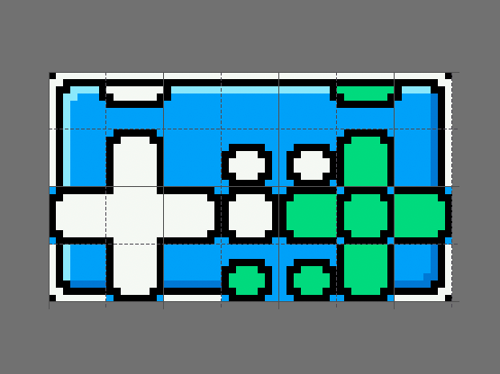
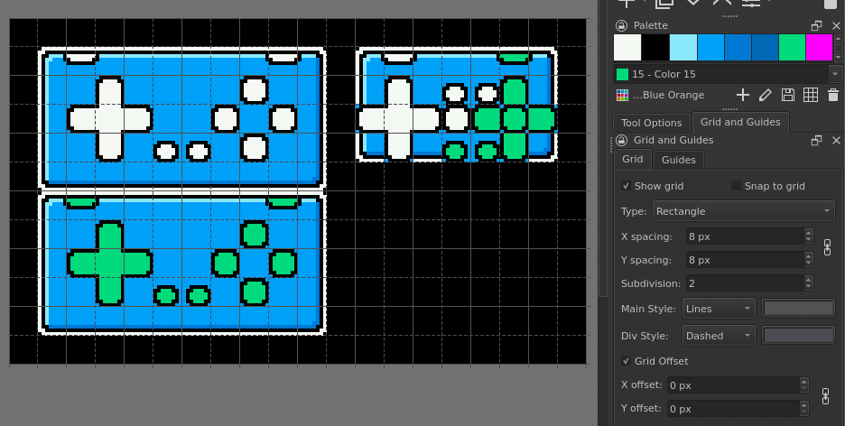

<!-- SPDX-License-Identifier: MIT -->
<!-- SPDX-FileCopyrightText: Copyright 2024 Sam Blenny -->
# Feather TFT Gamepad

This demonstrates a USB gamepad button press visualizer using using an Adafruit
USB Host FeatherWing and ESP32-S3 TFT Feather.


<br>*8x zoomed spritesheet with 8px/16px grid divisions*


<br>*editing the tilegrid and spritesheet in Krita*


## Hardware


### Parts

- Adafruit ESP32-S3 TFT Feather - 4MB Flash, 2MB PSRAM
  ([product page](https://www.adafruit.com/product/5483),
  [learn guide](https://learn.adafruit.com/adafruit-esp32-s3-tft-feather))

- Adafruit USB Host FeatherWing with MAX3421E
  ([product page](https://www.adafruit.com/product/5858),
  [learn guide](https://learn.adafruit.com/adafruit-usb-host-featherwing-with-max3421e))

- Adafruit FeatherWing Doubler
  ([product page](https://www.adafruit.com/product/2890))

- Tamiya Universal Plate Set #70157
  (3mm thick, 160x60mm ABS plates with 3mm holes on 5mm grid)

- M2.5 Nylon Standoff Set
  (misc. M2.5 machine screws, standoffs, and nuts)


### Tools and Consumables

- Soldering iron

- Solder

- Breadboard (to help with soldering)

- Soldering Vise (Adafruit [#3197](https://www.adafruit.com/product/3197) or
  similar)

- Flush diagonal cutters
  (Adafruit [#152](https://www.adafruit.com/product/152) or similar)

- Adhesive tape (kapton tape, electrical tape, painter's tape, or whatever)


### Pinouts

| TFT feather | USB Host |
| ----------- | -------- |
|  SCK        |  SCK     |
|  MOSI       |  MOSI    |
|  MISO       |  MISO    |
|  D9         |  IRQ     |
|  D10        |  CS      |


## Assemble the Hardware

If you are unfamiliar with soldering headers, you might want to read:

- [Adafruit Guide To Excellent Soldering](https://learn.adafruit.com/adafruit-guide-excellent-soldering/tools)

- [How To Solder Headers](https://learn.adafruit.com/how-to-solder-headers)


### Order of Soldering

1. The TFT Feather and USB Host Featherwing each come with two strips of
   16-position male header. Since feather boards have 16 holes on one side and
   12 holes on the other, use your flush cutters to trim 4 pins off the header
   strips for the 12-hole sides.

2. Assemble the USB Host Featherwing with pin headers on a breadboard, then
   solder the headers in place.

3. Locate the set of regular (non-stacking) female headers from your
   Featherwing Doubler kit. Remove the USB host featherwing from
   the breadboard, then put female headers onto the pins of the USB
   host featherwing.

4. Using the USB host featherwing to hold the female headers in place, put the
   female header pins into one of the silkscreened Feather footprints of the
   Doubler. Tape the ends of the USB host featherwing to the Doubler, being
   careful not to cover any of the pins.

5. Clamp the Doubler in a vise and solder the female headers in place.

6. Locate the set of female stacking headers from your Doubler kit. Remove the
   USB host featherwing from the Doubler, then put the stacking headers onto
   the pins of the USB host board.

7. Put the stacking header pins into the other silkscreen footprint of your
   Doubler board, then prepare the assembly as before with tape and a vise.

8. Solder the stacking header pins in place, then trim the excess length off
   the pins with your flush cutters.

9. Carefully assemble your ESP32-S3 TFT Feather with header pins on a
   breadboard. Leave the protective film in place to protect the display from
   flux splatter. Solder the header pins in place. You can use the solder wire
   to bend the pull tab of the protective film out of the way so it does not
   touch your soldering iron.


### Smoke Test and Final Assembly

1. (optional) Mount your Doubler board on a backplate (such as a Tamiya
   Universal Plate) so the board is easier to handle without shorts or static
   discharges.

2. Assemble the TFT feather and USB host featherwing onto the Doubler.

3. Try plugging your board into a USB charger to make sure the LEDs light up.

4. If the LEDs light up, unplug the USB power cable, then plug the USB gamepad
   into the Host featherwing's USB A port.


## Updating CircuitPython

**NOTE: To update CircuitPython on the ESP32-S3 TFT Feather with 2MB PSRAM and
4MB Flash, you need to use the .BIN file (combination bootloader and
CircuitPython core)**

1. Download the CircuitPython 9.1.1 **.BIN** file from the
   [Feather ESP32-S3 TFT PSRAM](https://circuitpython.org/board/adafruit_feather_esp32s3_tft/)
   page on circuitpython.org

2. Follow the instructions in the
   [Web Serial ESPTool](https://learn.adafruit.com/circuitpython-with-esp32-quick-start/web-serial-esptool)
   section of the "CircuitPython on ESP32 Quick Start" learn guide to update
   your board with CircuitPython 9.1.1. First erasing the board's contents,
   then programming it with the .BIN file. **(CAUTION: the normal UF2 file
   method does not work on this board because it does not have a large enough
   flash drive to hold the CircuitPython UF2 file)**


## Installing CircuitPython Code

To copy the project bundle files to your CIRCUITPY drive:

1. Download the project bundle .zip file using the button on the Playground
   guide or the attachment download link on the GitHub repo Releases page.

2. Expand the zip file by opening it, or use `unzip` in a Terminal. You should
   end up with a folder named prox-sensor-encoder-menu, which should contain a
   `README.txt` file and a `CircuitPython 9.x` folder.

3. Open the CircuitPython 9.x folder and copy all of its contents to your
   CIRCUITPY drive.

To learn more about copying libraries to your CIRCUITPY drive, check out the
[CircuitPython Libraries](https://learn.adafruit.com/welcome-to-circuitpython/circuitpython-libraries)
section of the
[Welcome to CircuitPython!](https://learn.adafruit.com/welcome-to-circuitpython)
learn guide.


## Converting PNG Spritesheet to BMP

After exporting to PNG from Krita, I converted my spritesheet to BMP like this:

```
gm convert gamepad_7x4_8px_sprites.png BMP3:sprites.bmp
```


## Running the Gamepad Demo Code

**TODO**
